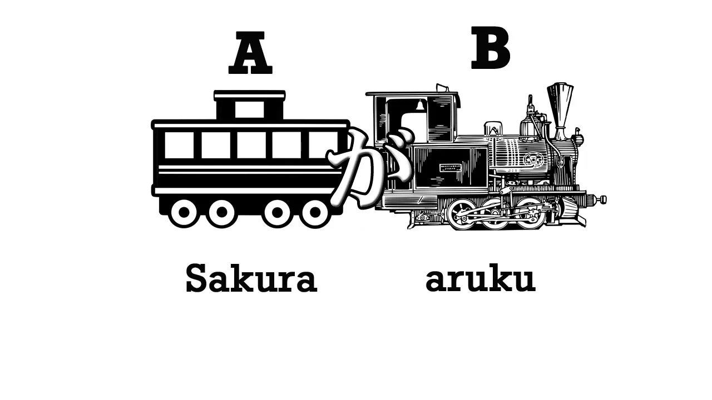
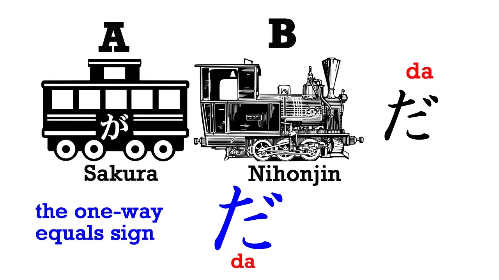
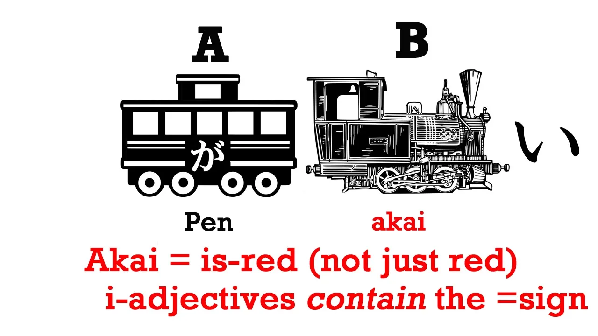
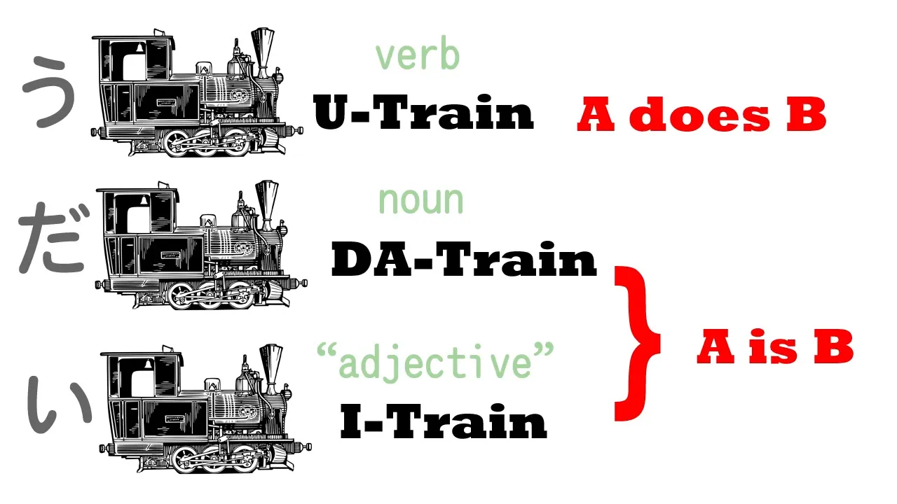

# **1. Các kiểu câu cơ bản trong tiếng Nhật**

Điều cơ bản nhất trong tiếng Nhật là **câu lõi** – *core sentence*. Mỗi câu tiếng Nhật đều xoay quanh một cấu trúc cốt lõi. Nó trông như thế nào? Hãy hình dung nó như một đoàn tàu.

Mỗi câu tiếng Nhật luôn có hai phần chính: **toa chính A** và **đầu máy B**. **Đầu máy (B)** là thứ kéo cả câu đi – làm cho nó có nghĩa. **Toa chính (A)** thì không thể thiếu, vì nếu không có toa thì đầu máy kéo cái gì?

Hai phần đó chính là cốt lõi của mọi câu tiếng Nhật.

Từ đây, bạn có thể mở rộng A, mở rộng B, nối nhiều câu lại với nhau để thành câu phức. **Nhưng dù phức tạp đến đâu, mọi câu tiếng Nhật đều bám vào khung cơ bản này.**

Vậy A và B cụ thể là gì? Hãy nhớ rằng, trong bất kỳ ngôn ngữ nào, **câu cũng chỉ chia làm hai loại:**

* Loại **"A là B"** (ví dụ: "Sakura là người Nhật")
* Loại **"A làm B"** (ví dụ: "Sakura đi bộ")

Chúng ta có thể chia chúng về quá khứ, phủ định, nghi vấn... nhưng **tất cả đều chỉ là biến thể của hai dạng gốc này**. Giờ ta sẽ xem tiếng Nhật thể hiện hai dạng này như thế nào.

## Câu động từ: “A làm B”

Ví dụ: “Sakura đi bộ” – đây là loại câu “A làm B”. Trong đó:

* **A là Sakura** – toa chính
* **B là “đi bộ”** – đầu máy

Trong tiếng Nhật, **“đi bộ” là「あるく」(aruku)**. Tuy nhiên, để thành câu hoàn chỉnh, ta cần một “mấu chốt” nữa – đó là **trợ từ が** (*ga*).

**が là trung tâm ngữ pháp tiếng Nhật.** Mọi câu tiếng Nhật đều xoay quanh が. Có những câu không thấy が, nhưng đừng lầm – nó vẫn ở đó, vẫn âm thầm làm nhiệm vụ nối A và B lại với nhau.

Vậy nên, câu cốt lõi “Sakura đi bộ” sẽ là:
**さくらがあるく** → **Sakura-ga aruku**

## Câu danh từ (Copula): “A là B”

Bây giờ thử kiểu câu “A là B”, ví dụ: “Sakura là người Nhật”.

* A vẫn là Sakura
* B là **にほんじん／日本人 (người Nhật)**
* Và tất nhiên, **phải có が nối lại**: **さくらが日本人** (Luôn cần có が để liên kết toa tàu chính với đầu máy)

Nhưng như thế vẫn chưa đủ. Ta cần thêm một yếu tố nữa – chính là **だ** (*da*).

Câu hoàn chỉnh sẽ là:
**さくらが日本人だ** → **Sakura là người Nhật**

Có thể bạn từng quen với phiên bản lịch sự hơn là **です**, nhưng ở đây ta sẽ học bản đơn giản nhất: **だ**. Nó giống như dấu bằng “=” vậy – **だ có nghĩa là “A là B”**.

Tại sao nói だ là dấu bằng "chỉ một chiều"? Vì:

* 「さくらが日本人だ」nghĩa là Sakura = người Nhật.
* Nhưng không có nghĩa người Nhật = Sakura. Chỉ có một Sakura thôi!

## Câu tính từ

Đến đây ta đã biết 2 dạng câu: “A làm B” và “A là B”. Giờ đến dạng thứ ba – **câu tính từ**, tức là câu dùng để **miêu tả đặc điểm của A**.

Trong tiếng Nhật, các **tính từ thường kết thúc bằng đuôi い**.

Ví dụ:

* Vui: うれしい／嬉しい
* Buồn: かなしい／悲しい
* Màu xanh: あおい／青い

(Chúng ta chưa cần nhớ tất cả đống này, nhưng cần nhớ rằng tính từ trong Tiếng Nhật kết thúc bằng đuôi い)

Giờ thử một ví dụ đơn giản:
**ペンが赤い／あかい** → Cây bút màu đỏ → “Cái bút là màu đỏ”

Có thể bạn sẽ thắc mắc rằng: **Trong câu này không cần だ.** Tại sao?

Vì **tính từ đuôi い như「赤い」(màu đỏ) đã bao hàm ý “là” trong chính nó rồi**. Nói cách khác, **“赤い” không chỉ là “đỏ”, mà là “là đỏ”**.

Vậy là ta có ba dạng câu cốt lõi trong tiếng Nhật:

1. **Câu động từ**: kết thúc bằng một động từ (đuôi う)
2. **Câu danh từ (copula)**: kết thúc bằng だ
3. **Câu tính từ**: kết thúc bằng một tính từ đuôi い

Tất cả đều:

* Bắt đầu bằng **chủ ngữ (A)**
* Nối với phần còn lại (B) bằng **trợ từ が**
* Kết thúc bằng một trong ba kiểu: động từ, だ, hoặc tính từ い

Hiểu được ba loại câu này chính là nắm được nền tảng của tiếng Nhật.

