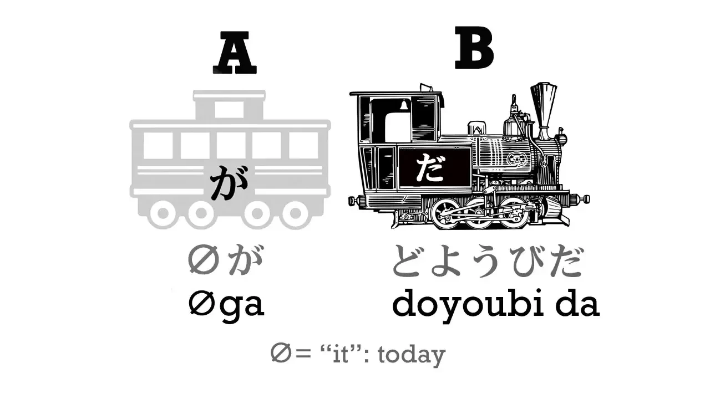
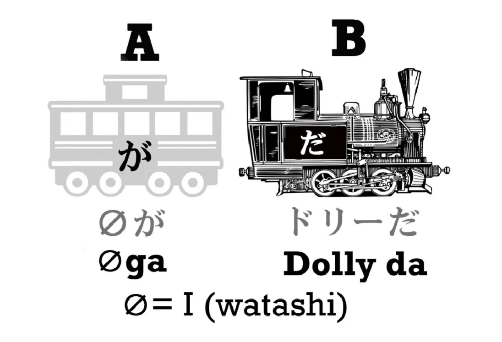
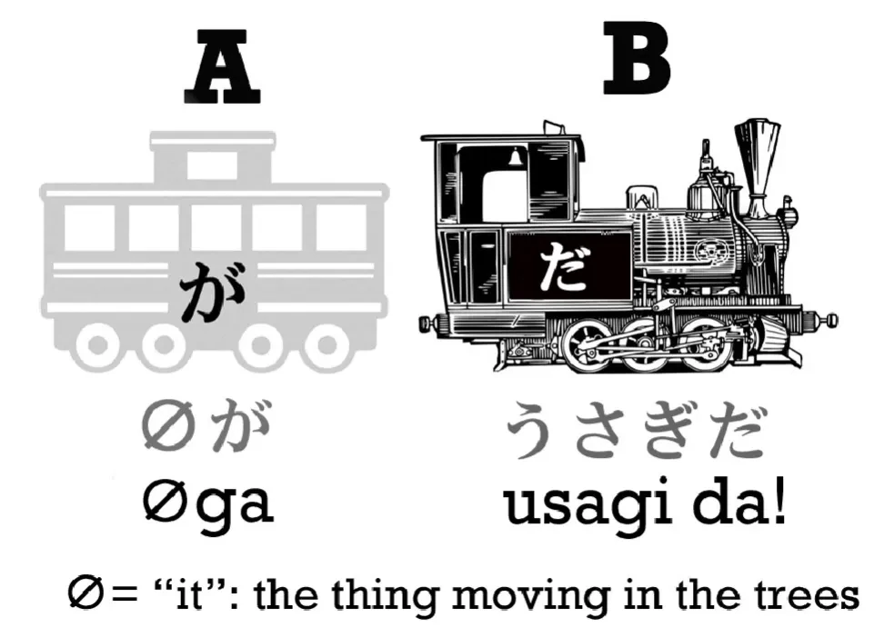
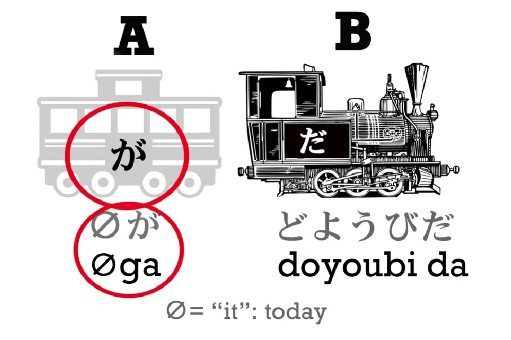
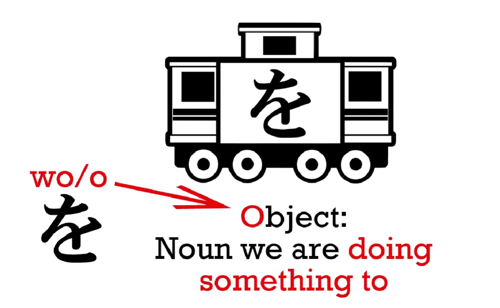
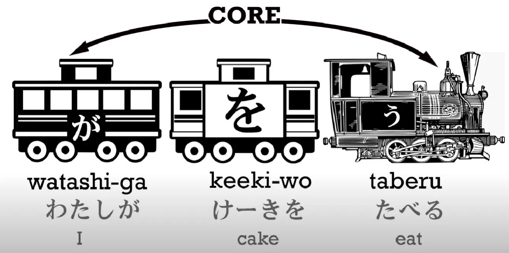
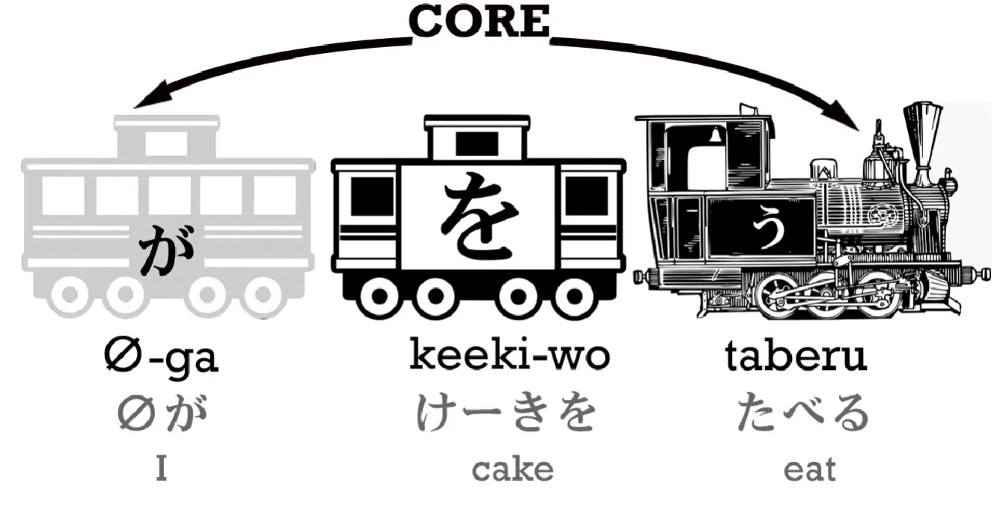

# 2. Toa tàu vô hình và trợ từ を

## Toa tàu vô hình

Ở bài trước, bạn đã biết rằng mọi câu tiếng Nhật đều xoay quanh một cấu trúc cốt lõi giống nhau: một cái "toa chính" và một cái "đầu máy". Nói cách khác, đó là phần **nội dung chính** ta muốn nói đến, và phần **nhận định** ta nói về nó – hay còn gọi là phần A và phần B.

Câu càng dài thì có thể càng nhiều "toa phụ", nhưng lõi của nó thì không thay đổi.

Giờ, ta sẽ nói về một loại "toa phụ" đặc biệt. Trước đây tôi đã nói rằng trong câu tiếng Nhật, đôi khi bạn **không nhìn thấy đầy đủ cả hai phần A và B** – thường thì bạn sẽ thấy phần B (đầu máy), nhưng **phần A (toa chính) có thể bị ẩn đi**, và thay vào đó là một **toa tàu vô hình**.

Vậy **toa tàu vô hình** là gì? Gần nhất trong tiếng Anh, nó giống như từ **"it"**.

Hãy xem "it" trong tiếng Anh hoạt động thế nào:

> Quả bóng lăn xuống dốc.
> Khi quả bóng tới đáy, quả bóng đập phải một hòn đá nhọn.
> Quả bóng bị thủng và không khí bên trong tràn ra.

Không ai nói vậy cả. Thay vào đó, người ta sẽ nói:

> Quả bóng lăn xuống dốc.
> Khi **nó** tới đáy, **nó** đập phải một hòn đá nhọn.
> **Nó** bị thủng và không khí bên trong tràn ra.

"It" không có nghĩa cố định – nó chỉ có nghĩa nhờ vào **ngữ cảnh**. Nó có thể là bông hoa, bầu trời, ngón tay, tháp Eiffel, hay cả thiên hà Andromeda.

Giờ thử tưởng tượng một đứa trẻ nói:

> Bóng lăn xuống dốc,
> tới đáy, đập đá nhọn,
> bị thủng, xì hết hơi.

Có khó hiểu không? Không hề. Vì thực ra ta chẳng cần "it" để hiểu câu. Tiếng Anh yêu cầu về mặt ngữ pháp, nhưng về mặt giao tiếp, rõ ràng là không cần thiết.

Và tiếng Nhật **không có "it"** – ít nhất là không theo cách tiếng Anh dùng nó để thay thế.

Giống như nếu một bé gái nửa đêm xuống bếp và nói:

> Đói quá. Xuống kiếm gì ăn.

Không có "I", nhưng ai cũng hiểu là: "Tôi đói. Tôi xuống kiếm gì ăn."

Trong tiếng Anh, đây là câu sai ngữ pháp. Nhưng trong tiếng Nhật, nó hoàn toàn hợp lệ. Tất cả những đại từ như **"I", "he", "she", "it", "they"** đều có thể được **ẩn đi** – được thay bằng **toa tàu vô hình**, hay gọi là **zero pronoun**.

Điều quan trọng là: **chúng vẫn tồn tại về mặt ngữ pháp, chỉ là không nói ra thôi.**

Giờ, ví dụ trong tiếng Nhật: tôi nói 「ドリーだ」 nghĩa là "Tôi là Dolly".

Nghe thì như chỉ có "đầu máy" (だ) mà không có "toa chính". Nhưng thật ra **toa chính đang bị ẩn đi** – câu đầy đủ là 「（**zeroが**）ドリーだ」.

Toa vô hình (zero) ở đây mặc định là "tôi", trừ khi ngữ cảnh nói về ai khác.

Ví dụ khác: nghe tiếng sột soạt trong bụi, nhìn về phía đó và nói:

> 「ウサギだ！」

Tức là: 「（**zeroが**）ウサギだ！」– "Là thỏ kìa!"
"Zero" ở đây là **cái gì đó chúng ta vừa nhìn thấy** – và nó chính là con thỏ.

Hoặc khi bạn nói:

> 「土曜日だ。」

(土曜日 = thứ Bảy)
Tức là: "Hôm nay là thứ Bảy."
"It" ở đây là "hôm nay" – và nó bị ẩn, nhưng vẫn tồn tại: 「（zeroが）土曜日だ。」

## Trợ từ を

Giờ, ta đến một loại "toa" nữa: **toa を** – tức là danh từ đi với trợ từ 「を」 (đọc là *o*).

Nếu bạn biết một chút về ngữ pháp tiếng Anh, "object" nghĩa là **đối tượng bị tác động** – thì hãy nhớ: "o" là viết tắt của "object" nhé!

Trong cấu trúc tàu, toa を thường có màu **trắng**, vì nó **không phải là lõi chính** của câu.
Tàu chính chỉ có **toa đen** – tức là toa chính (A/ga) và đầu máy (B).
Các toa trắng là phần mở rộng – giúp nói thêm về A hoặc B.

Ví dụ:

> 「わたしがケーキを食べる」
> "Tôi ăn bánh"

Lõi chính ở đây là: **Tôi ăn** (わたしが食べる) – đó là hai toa đen. Còn **ケーキを** là toa trắng – nói thêm **tôi ăn cái gì**.

Nhưng đôi khi bạn sẽ thấy câu rút gọn:

> 「ケーキを食べる」

Không có "tôi" ở đâu cả. Nhưng bạn đã biết điều gì đang xảy ra rồi đấy: **toa A (わたしが) đang bị ẩn đi**, và được thay bằng **toa vô hình**.

**Không thể có hành động mà không có người làm hành động.** Dù không nói ra, thì câu này vẫn ngầm hiểu là:

> 「（zeroが）ケーキを食べる」– "Tôi ăn bánh."

Vì trong giao tiếp bình thường, khi chủ thể không rõ ràng thì mặc định là "tôi".

Tuy nhiên, nếu trước đó đang nói về người khác, thì "zero" sẽ được hiểu là người đó – tuỳ vào **ngữ cảnh**.

Lưu ý
	
Như hình minh hoạ, **trợ từ tiếng Nhật luôn gắn với từ đứng TRƯỚC nó**, không phải từ sau.

