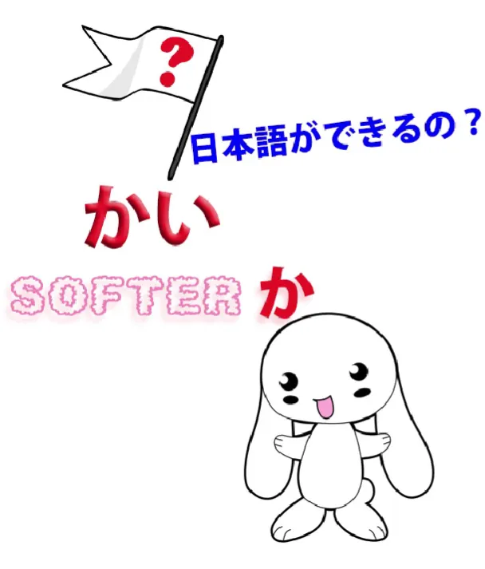
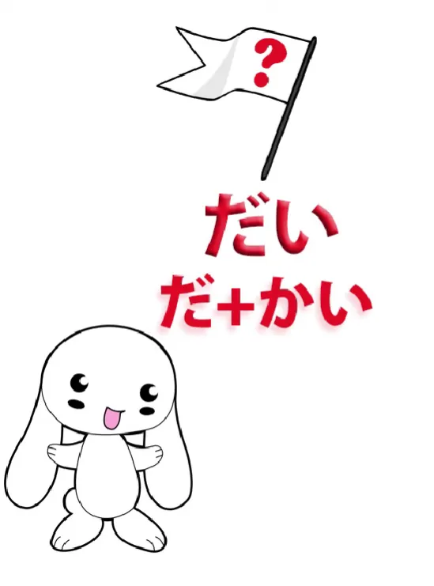
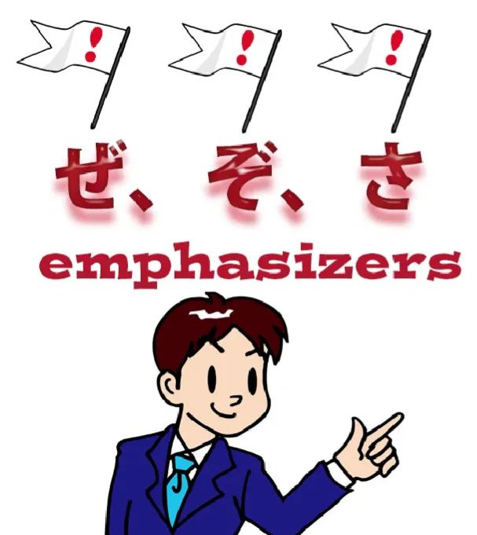
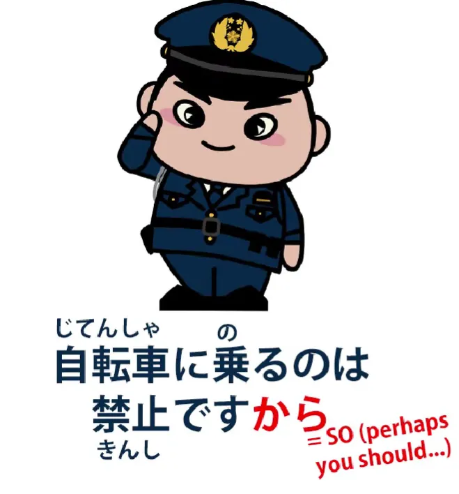

# **63. WILD sentence enders in real life Japanese かい、だい,、ぜ、ぞ、さ、から、し、ちょうだい**

[**WILD sentence enders in real life Japanese かい、だい,、ぜ、ぞ、さ、から、し、ちょうだい | Lesson 63**](https://www.youtube.com/watch?v=CVJ4jTlxyno&list=PLg9uYxuZf8x_A-vcqqyOFZu06WlhnypWj&index=65&pp=iAQB)

こんにちは。

Today we're going to talk about some more of those things that hit us between the eyes as soon as we leave the walled garden of theoretical Japanese and venture into the wild woods of the real thing. One of the things people often ask me about are the various sentence-enders they encounter. And I'm not talking about the tame ones like <code>ね</code>, <code>よ</code> and <code>な</code> – I've done [**a video**](https://www.youtube.com/watch?v=IWEok4Ivfyc) about those if you're interested and I'll pop a link for that over my head.

But today we're going to talk about some of the more colloquial and unconventional sentence-enders that you're going to run into once you get into <code>wild Japanese</code>  
in anime, manga, etc.

## かい

So, one of the ones I often get asked about is <code>かい</code>,  
and <code>かい</code> is simply a softened and colloquial form of <code>か</code>. As we know, <code>か</code> is regularly used in formal Japanese, where we use the です/ます decorations at the end of sentences, to form questions. So we say <code>何々しますか / 何々ですか</code>.

But in colloquial Japanese we don't use <code>か</code> as a sentence-ender question-marker all that often. **We do use it in other positions** -- and I've done a video about the various ways we use <code>か</code> *(Lesson 39)* and I'll pop a link for that over my head too. But where we don't tend to use it in informal speech, on the whole, is at the end of sentences marking questions, the way it does in です/ます Japanese.

And that's not because it's ungrammatical, in fact it's perfectly grammatical, but in modern Japanese it's come to sound a little bit rough, so while you may hear it between men who are being <code>one of the boys</code> together, you don't hear it so often in female speech or in the speech of anyone who's trying to be a bit courteous. So what do we do? Most of the time we simply use a rising intonation in speech or a question mark in writing where we're depicting casual speech. And there's nothing wrong with this.

Spanish continually makes questions by simply adding a rising intonation to the equivalent statement and there are no problems there. There are no problems in Japanese either. Sometimes we add <code>の</code>, which is ambiguous, because it can mark either a question or a statement, but again that doesn't really matter because intonation works just as well.



However, we do have the informal, non-rough-sounding question-marker <code>かい</code>. You might think that would be used all the time, **but it isn't**,  
because it sounds very colloquial indeed and sometimes a little bit... well, folksy. Some sources say it's primarily masculine and that's kind of half-way true. You don't hear many younger female speakers using it, but you do sometimes hear older female speakers using it.

## だい (& どうだい)

<code>かい</code> also has a partner, which is <code>だい</code>.

**<code>だい</code> is really <code>だ</code> plus <code>かい</code>.**

So this is the form of <code>かい</code> that we use in  
copula-ending sentences, <code>だ</code>-ending sentences.



And just about everything I've said about <code>かい</code> also applies to <code>だい</code>,  
**except** that there is a particular collocation, <code>どうだい</code>, which is much more widely used. So, if somebody's eating something and you say <code>どうだい?</code> -- <code>what's it like? / how is it?</code> -- and they might say <code>おいしい/美味しい!</code> or they might say <code>まずい/不味い</code>, but **asking it in that form is something anybody can do provided it's an informal setting.**

## ちょうだい

People also come across the expression <code>ちょうだい</code>, **and that's not related to <code>かい</code> or <code>だい</code> at all;**
**it's an informal equivalent to <code>ください</code>.** So it's usually adding it to the て-form of a verb to ask someone to do something. It's sometimes considered to be female speech **but it is not exclusively so.**


## ぜ、ぞ、さ

Other real sentence-ender markers in casual speech are <code>ぜ</code>, <code>ぞ</code> and <code>さ</code>. Now, <code>ぜ</code> and <code>ぞ</code> are very simple. They're just verbal exclamation marks which lend a little force to whatever it is you're saying. **They're quite rough and really are masculine speech**
**and they're the sort of thing you'll probably see**
**more in anime and manga than you will in real life.**



<code>さ</code> is similar but it's not nearly so rough. **It's much more widely used**, you'll see a lot of it, and you'll hear it in real life. It tends to get called masculine speech, but again **it's not exclusively masculine speech**. All kinds of people use it.

**It's important not to confuse <code>さ</code>, the emphasis-lending sentence-ender,**
**to <code>さあ</code>, which comes at the beginning of a sentence and is more of a pause-for-thought kind of expression.**

---

Now, there are also sentence-enders **that are not sentence-enders but effectively they are**, because people do pop them after the engine at the end of a sentence.

  
Here, Dolly also suggests watching this [**video**](https://www.youtube.com/watch?v=Au5JOtcwE7A&ab_channel=OrganicJapanesewithCureDolly) on pseudo-enders, のに & なのに respectively.

One of these is <code>から</code>.

## から <code>sentence-ender</code>

Now, <code>から</code>, as you know, **is not technically a sentence-ender.**
**What it is is a conjunction that joins two logical clauses to make a compound sentence.** So a proper use of <code>から</code> might be: <code>さくらが来ないから帰ります</code>, which means  
<code>Because Sakura isn't coming, I'm going home / Sakura isn't coming, so I'm leaving</code>.

However, you might simply say as you are leaving, <code>さくらが来ないから</code>,  
and that is just leaving the other half of the sentence unsaid because it's obvious. Now, from that, <code>から</code> can be added to a lot of sentences to imply that something else is coming.

**That extra something else isn't always completely clear.** In fact, the <code>から</code> may be performing the function of either softening what it marks or hardening it.


It can soften it by making the statement feel explanatory; it can harden it by making it sound as if it's part of a logical argument or a natural piece of reasoning that the hearer ought to understand and agree with.

So, for example, if you're riding your bicycle in a place where you shouldn't be riding a bicycle and somebody official comes up to you and says <code>自転車に乗るのは禁止ですから</code> \[polite tone\], that's conciliatory, and really all they want to say is <code>It's forbidden to ride a bicycle around here</code>, but by adding the <code>から</code> to the end of it, they're kind of softening it, turning it into an explanation for you.



Conversely, they might say <code>自転車に乗るのは禁止ですから</code> \[stern tone\], and that has a different implication. There, the <code>禁止</code> is being rammed home all the harder for that <code>から</code>.


So, <code>から</code> can have a variety of uses, often depending on context, on the way in which they're said, on the demeanor of the person saying them, and on the whole situation.

## し sentence-ender

<code>し</code> is another very common sentence-ending particle which is similar to <code>から</code> and has a meaning in the same area. <code>し</code> can actually combine various conditions or statements, **but its most common and regular use is to combine reasons.**

So, for example, we might say, <code>遅くなったしさくらが来ないし帰ります</code>, and that means "Because it's gotten late and because Sakura isn't coming, I'm going home". And **this is the most standard kind of use of <code>し</code>.**

---

But then we might often use it for only one condition, implying others. For example, if we said <code>遅くなったし帰ります</code>, we're saying <code>because it's gotten late, I'm going home</code>, **but we're also implying that the fact that it's gotten late isn't the only reason:** <code>Because it's gotten late (and for other reasons) I'm going home.</code>

And this, in this particular case, probably implies that it's not just because it's getting late, **it's also because Sakura isn't coming, but we're leaving unstated the more personal part of it.**

Now conversely, we might say <code>さくらが来ないし帰ります</code> and this time we've put in the most important part, the real reason for our leaving, but by saying <code>し</code> rather than <code>から</code> we're also saying <code>Because Sakura isn't coming (and for other reasons) I'm leaving.</code>

**What this does is take the pressure off Sakura.** Although she may be the main reason, we're diffusing it a bit by suggesting that there are also other reasons.
**And we might do this when there are no other reasons at all,**
**just as a way of softening and diffusing the statement.**

Another example might be, suppose you're riding your bicycle again in that place where you shouldn't be riding it and this time a friend comes up to you and says, <code>自転車に乗るのは禁止し</code>.


::: info
Yes, normally, after 禁止, there would be だ before し. But since this is casual, it is left off.
:::
Now, **the difference between this and the <code>から</code> statement**
**is simply that the <code>し</code> is diffusing it.** It's saying "Oh, because it's forbidden to ride a bicycle here and for other reasons..."

**Now, there aren't any <code>other reasons</code> at all, but**
**what this does is make it sound a bit more colloquial, a bit more friendly**,  
and it vagues up a bit that <code>から</code> which can sound too much like an order. It's just saying <code>Oh, for that and other reasons</code>.

And this <code>vaguing up</code> tactic often takes place in languages. In English it's often done by adding words like <code>like</code> or <code>kinda</code> to what you're saying.

Now, the ways in which these sentence-enders work can't be learned from structure alone or from abstract instruction alone. **We need to immerse in Japanese to get the feel of**
**what people mean when they say these things.**

But conversely, understanding the structure, understanding how they really fit together, gives us a substantial boost in being able to make sense of our immersion. It's rather like a rope and climbing a mountain.


::: info
Indeed, ‘tis modified a bit …somewhat…\*cough\*…bizarrely… ╮(︶▽︶)╭  
*If you have a rope, that will help you climb the mountain,
:::

but if you just stand staring and learning all about the rope you'll never get to the top of the mountain. Conversely, if you try to climb the mountain without the rope, you may not get very far…
```