# **84. である and the Structure of Japanese. What older copulas tell us: である, であります、でござる、でございます**

[**De-aru and the Structure of Japanese. What older copulas tell us: である, であります、でござる、でございます | Lesson 84**](https://www.youtube.com/watch?v=hS02cADsjfI&list=PLg9uYxuZf8x_A-vcqqyOFZu06WlhnypWj&ab_channel=OrganicJapanesewithCureDolly)

こんにちは。

Today we're going to talk again about that element of Japanese
that gives us the key to about a third of all Japanese sentences,
and that is the copula.


::: info
Notice how copula LINKS together the A (Subject) and B (Predicate), that is its function.
:::
Now, I've talked quite a bit about the copula before
and I'll put links in the information section below
so that you can follow that up. *(Lesson 40, 41, 55, 77 & 79 I think…)*

**But today I want to look at slightly less commonly used versions of the copula**
which you are going to see quite a bit in your immersion
and that raise certain questions about the structure of the copula itself
which we're going to address.

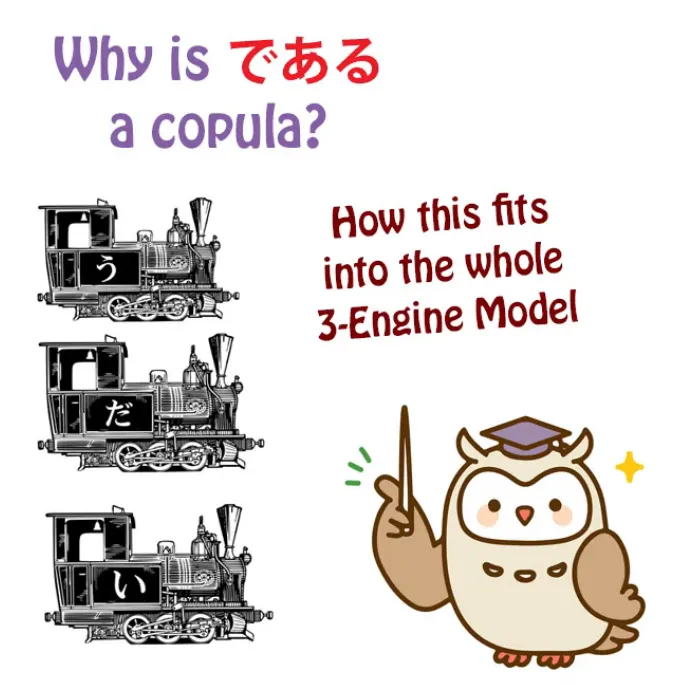

**These are: <code>である</code>, <code>であります</code>, <code>でございます</code> and <code>でござる</code>.**

Now, we can deal with the last three very quickly,
**because all of them are just variants of the first one, <code>である</code>.**

## であります

**<code>であります</code> is obviously <code>である</code> with the <code>ます</code> helper verb attached.**

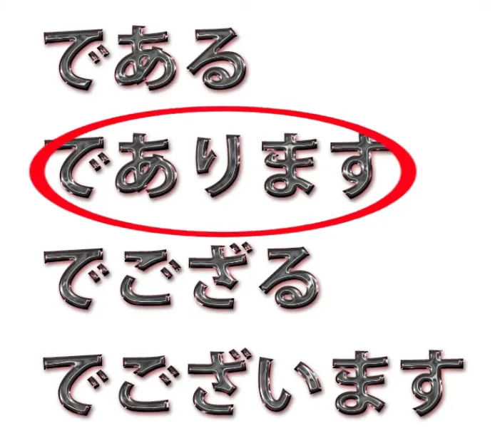

## でござる

**<code>でござる</code> -- <code>ござる</code> is simply a polite, keigo version of <code>ある</code>, the verb of being.**

Now, how does the verb of being get into this? Well, we'll talk about that in a minute.

**<code>ござる</code> is simply made up of the honorific <code>ご</code> plus <code>ざる / 座る</code>,**
**which originally means <code>seated</code>, but has the extended meaning of <code>existing</code>.**

::: info
座る is normally read as すわる, but its On-yomi reading is ざ, therefore ざる here because I guess it is referring to its extended meaning of <code>existing</code>?
:::
**So <code>ござる / ご座る</code> is just <code>ある</code> in fancy form.**


**You won't hear <code>でござる</code> very much at all because since it's an honorific form**
**these days it's nearly always used with the <code>ます</code> helper verb attached.**

But you will hear <code>ござる</code> perhaps in period drama and things like that. **It's samurai talk.**

## でございます

**<code>でございます</code> is the form of the copula that's used in keigo,**
so **you'll hear it in shops, you'll hear it in public announcements**,
and you'll hear it used by speakers in anime etc who are using very honorific speech,
perhaps sub-villains talking to the main villain.

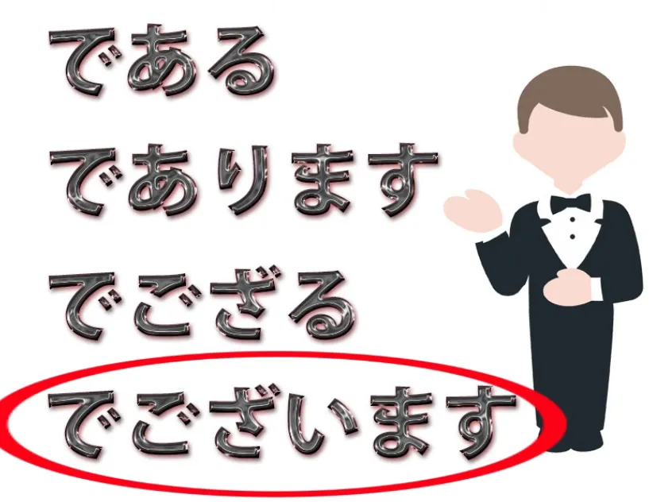

So that's really all we need to say about those three.

## である

**But <code>である</code>, which is the root of all of them, is the one we need to pay attention to.**

You could call it, in a way, **the <code>straight copula</code>.**

**<code>だ</code> sounds casual, <code>です</code> is polite, but <code>である</code> is just the copula.**

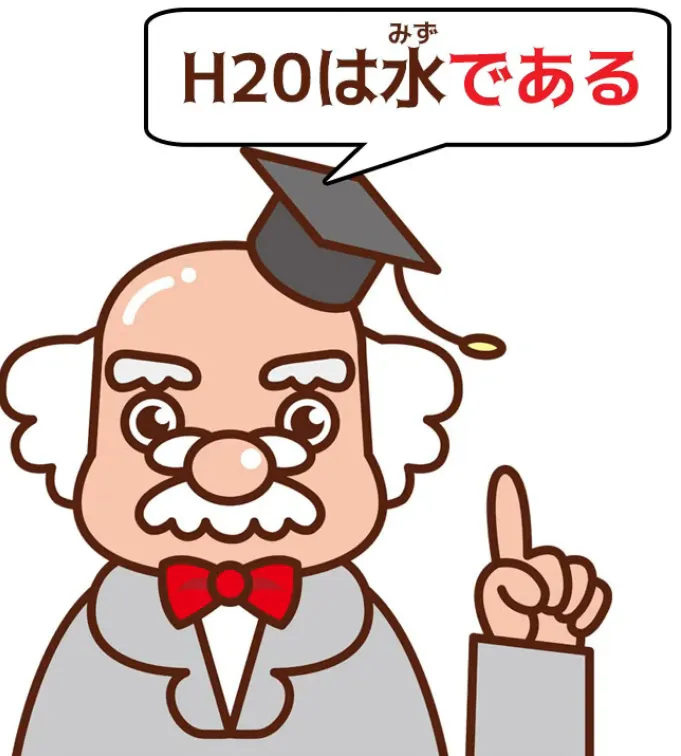

**We see it used in contexts where we're simply being objective,**
**such as academic papers, newspaper reporting, that kind of thing.**
**We'll also see it used in other contexts regardless of**
**what register the writing is in because it has a particular quality.**

---

**As we know, <code>だ</code> and <code>です</code> can only be used at the end of a logical clause.**
**They are logical-clause endings and they can't be used to pre-modify a noun.**
**If we want to pre-modify a noun with another noun marked by the copula,**
**we can only do that if it's an adjectival noun, because adjectival nouns**
**can use the pre-modifying version of the copula, which is <code>な</code>.**

---

We can say <code>花が**綺麗だ**</code> (flower **pretty-is**)
or we can say <code>**綺麗な**花</code> (**pretty-is** flower).

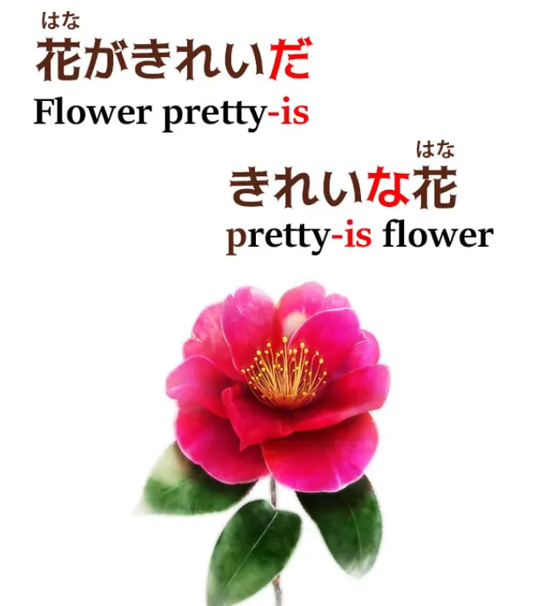

And it's precisely because this group of nouns --
and I've talked about the three groups of special nouns
in another video if you'd like to look at that *(Lesson 41)* --
**this particular special group of nouns, adjectival nouns, has the property**
**that it's able to use the pre-modifying form of the copula, <code>な</code>.**

This is something that the textbooks don't seem to know. They don't tell you what <code>な</code> is and they tell you that adjectival nouns
are actually some weird thing called <code>な-adjectives</code>. But that's another matter.

**So what do we do if we want to use a copula-marked noun**
**as a pre-modifier and it isn't an adjectival noun?**

Now, we don't do this an awful lot because
we can work around the situation by using <code>の</code>. But in some cases either this doesn't work
or it just isn't what we want to do.

So, suppose we want to say <code>Sakura **who is** a university student</code>. Now, we can say <code>大学生**の**さくら</code>, which is <code>the university student Sakura</code>.

But suppose we don't want to say that. **Suppose we actually want to say <code>Sakura who is a university student</code>?** *(make a relative clause)*


It's not quite the same, in Japanese or English. **In order to do this we have to use the copula and**
**we have to use it as a pre-modifier, so we have to use <code>である</code>.**

**It's our only choice. We can't use <code>だ</code> or <code>です</code>**
**because they can only be used at the end of a logical clause.**
**And we can't use <code>な</code> because <code>大学生</code> is not an adjectival noun.**

---

So we say <code>大学生**である**さくら</code>. *(Sakura **who is** a university student)*

And you'll see that sometimes, especially in written material.

---

**But there are cases where you really don't have the choice at all.**
**For example, if you want to say <code>the state of being round</code>**,
you would say <code>円形**である**さま</code>.


Now, **<code>さま</code> is a state or condition.**
**We can't really use の here; <code>円形のさま</code> doesn't really work.**

So we really have to say <code>円形**である**さま</code>.

Now, **when I say that <code>である</code> is the straight copula,**
not the casual one, not the polite one, just the straightforward copula,
there's another reason for this,
**because ultimately and historically
<code>だ</code> is simply an abbreviation of <code>である</code>**
**and <code>です</code> is an abbreviation of <code>であります</code>.**


So, if you've followed my course, if you've been
trained up to look at Japanese structurally,
there are certain questions that this may make you want to ask,
and some people have asked me.

First of all, haven't I presented the copula as an indivisible, special unit,
one of the three engines, but
**here it seems to be made up of two elements,**
**<code>で</code> and <code>ある</code>, and it looks very much like a verb.**

So what's going on here? And then,
**why in any case do the elements <code>で</code> and <code>ある</code>**
**add up to the concept of the copula?**

### Why で & ある add up to make copula

Now, let's look at this second part first and then we'll look at the first part.

Why do <code>で</code> plus <code>ある</code> make the copula concept? **Well, as we know there are two <code>で</code>s in Japanese.**
**There's the particle <code>で</code> and then there's the て-form of the copula.**


The textbooks don't tell you this. They let you think everything is the particle <code>で</code>.

**But as we know there are two <code>で</code>s.**
**Now, the one we're dealing with here is obviously the particle <code>で</code>.**

::: info
Huh…funny that this で particle thing was also one of my theories about である (and だ)
:::
**It can't be the て-form of the copula because the fundamental copula**
**can't be made up of two elements, one of which is already the て-form of itself.**

And in order to understand what's going on here,
why <code>で</code> and <code>ある</code> add up to the copula, we need to know two things.

Now, I've made videos on both of these and I'll link them as well,
but let's just recap it here.
::: info
it’s a bit hard to say which videos Dolly meant, but if so review Lessons 40, 41, 55 and 79.
:::
**The two things we need to know are first of all what the copula actually is,**
**and the second is what the particle <code>で</code> actually does.**

#### What the copula actually is / does

**What the copula actually is is something that takes two nouns, A and B,**
**and tells us that noun A is part of a set represented by noun B.**

That's what the copula does. **That's all it does.**

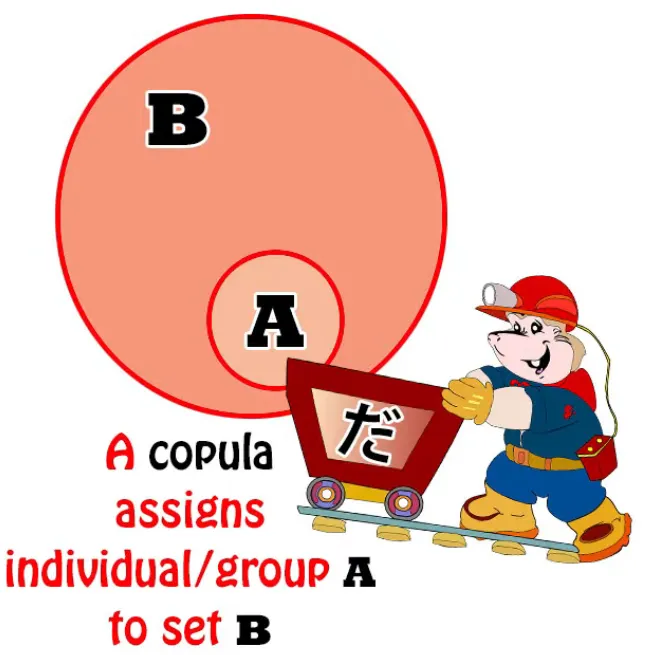

So if we say <code>さくらが日本人だ</code>
**we're saying Sakura (noun A) is part of the set Japanese people (noun B).**

**And sometimes the set can be a set of one.**
So if we say <code>That person over there **is** Sakura</code>, then we're saying that
**that person over there belongs to the set of one which is Sakura.**

**We're not talking about other Sakuras.**
**We're talking about this particular Sakura.**

---

#### What the particle で is / does

**So now, what does the particle <code>で</code> actually do?**

I've made a video about that and I'll link it. *(Lesson 55)*

**Fundamentally the particle <code>で</code> defines the limit or field or parameter**
**within which an action takes place or a state of being prevails.**

---

**So the simplest use of <code>で</code> is to say where an action takes place:**
<code>**公園で**遊ぶ</code> (play **in the park**) --
**the park, which is marked by <code>で</code>, is the field, the area, the parameters, within which I play;**

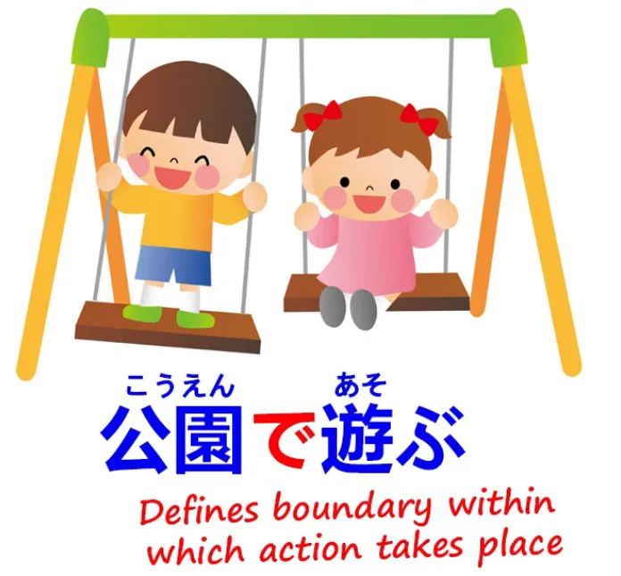

<code>**世界で**一番おいしいラーメン</code> (the most delicious ramen **in the world**) --
**the world marked by <code>で</code> marks the field, the area
within which this ramen is the first, number one.**

---

**And it gets extended a bit further in other cases.**
**It could be the material something's made with, the tool something is made by, etc.**
**In all cases it singles out a particular parameter from other parameters**
**that allow the making to take place.**

### Back to である

Now, when we take <code>である</code>, what this is saying is
**exist (ある) within a particular boundary or parameter;**
in other words, **exist within a set.**


**And that's what the copula tells us.**
**It tells us what set, what boundary, something exists in.**

Sakura **exists within the boundary of** Japanese people.

If we say <code>鷲が鳥**だ**</code> (an eagle **is** a bird) we're saying
**an eagle exists within the boundary, within the parameter, within the set, <code>birds</code>.**

And this is what the copula always does. **So <code>である</code> is a very precise construction of the copula.**

So let's get to the second question.

#### Is である / the copula a verb?

The second question is, **does this mean that it isn't really**
**an indivisible element of Japanese, one of the three engines?**
**And does it mean that it's a verb?**

**Because obviously <code>ある</code> is a verb, and it's because**
**<code>ある</code> is a verb that we can use it as a pre-modifier.**

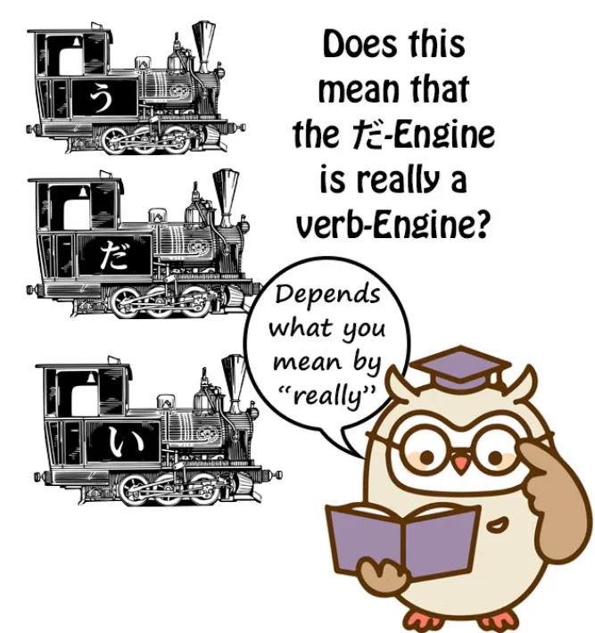

We can say <code>大学生**である**さくら</code> because
**you can always use a verb to pre-modify a noun.**

And the answer to the question is that this is a question of modeling.

I model Japanese in a particular manner. **It is possible to model it in other manners.**

**In Japanese grammar as taught to Japanese students, the copula is regarded as a verb.**
*(thus, copula has a verbal function = it can theoretically be regarded as a special kind of verb)*

---
And in fact **an adjectival noun plus the copula is called a <code>形容動詞</code>,**
**which means an adjectival verb.**

**The <code>verb</code> part is the copula which is added to it.**

So **<code>綺麗</code> is not a 形容動詞;** <code>**綺麗な**</code> or <code>**綺麗だ**</code> **is a 形容動詞**.
**And the <code>動詞</code> part, the verb part, is the copula.**

---

**But I do not model the copula as a verb.**
**And the reason for that is that in our three-engine structure**
**I restrict the term <code>verb</code> to those entities that end in う-row kana**
**and do all the things that those entities do: we have the four stems, etc.**

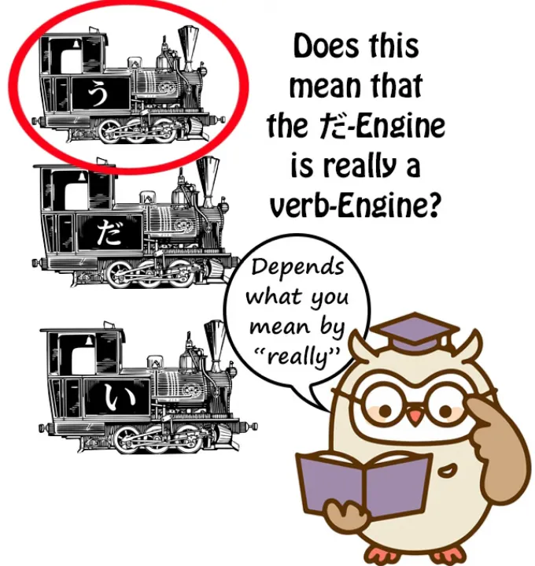

::: info
This further shows that there are different ways to view language, and both can work in their own systems, so it is best to be aware of both ways & use them as what works for you.
:::
**The copula doesn't work like this in modern Japanese. It works differently.**

<code>である</code> has evolved into an entity in itself with its own て-form,
which it has, with its own connective form, <code>な</code>, which it has.

**We could, if we wanted to, model all three engines as verbs,**
**because in many ways adjectives are also verb-like.**
**But they don't work like the う-ending entities and they don't work like the copula.**

So, within my model of Japanese,
which I think is the best one for non-native learners of Japanese to use,
we use the three-engine structure.

We regard verbs, adjectives and the copula as three unique entities.

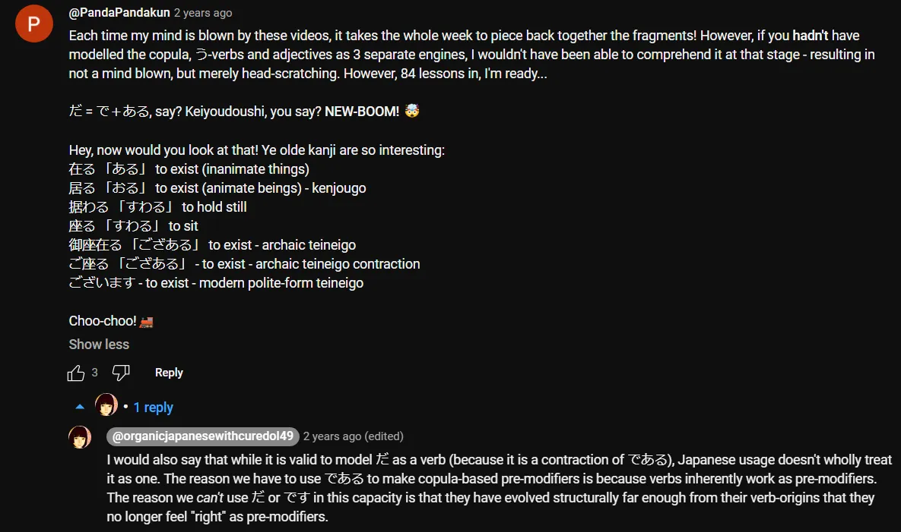

**This is not a statement about the etymology of Japanese.**
**It's not even a statement about the <code>real truth</code> of Japanese grammar,**
because there is no <code>real truth</code> in grammar.

**Grammar is simply a means of describing**
**a pre-existing phenomenon, which is language.**

**Grammar is not the source code of language.**
**Grammar is an attempt to describe language by modeling it.**

And I use and recommend the three-engine model. **If you prefer another model, you're free to use it.**

---

**The other reason I maintain that distinction is because it's very important**
**not to confuse <code>で</code> which is the て-form of the copula with the particle <code>で</code>,**
**and it's very important not to confuse the concept of the copula**
**with the verb of being, <code>ある</code>.**

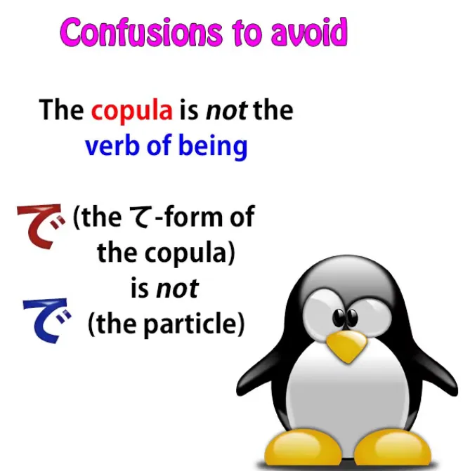

And that happens all too easily to English speakers
or people who are very familiar with English,
**because in English the copula and the verb of being**
**are represented by the same word,**
**and that's <code>is</code> and its variants <code>was</code>, <code>am</code>, <code>are</code>, etc.**

They're the same word, but they're not the same concept.

---

**So when we say that <code>だ</code> and <code>です</code> mean <code>is</code>,**
**this is a confusing way of looking at it.**
**They don't mean <code>is</code> in all circumstances;**
**they mean <code>is</code> when it's the copula.**

So if we say <code>That animal **is** a rabbit</code>, this is **the copula**.
**We're placing <code>that animal</code> into the set <code>rabbit</code>.**

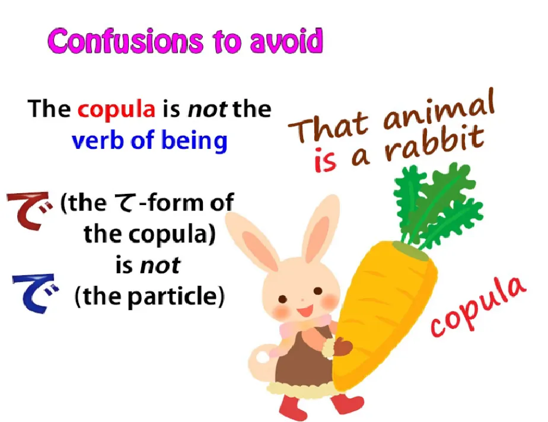

---

If we say <code>There **is** a rabbit</code>, **that's not the copula, it's the verb of being.**
**We're saying a rabbit exists, there in that place.**

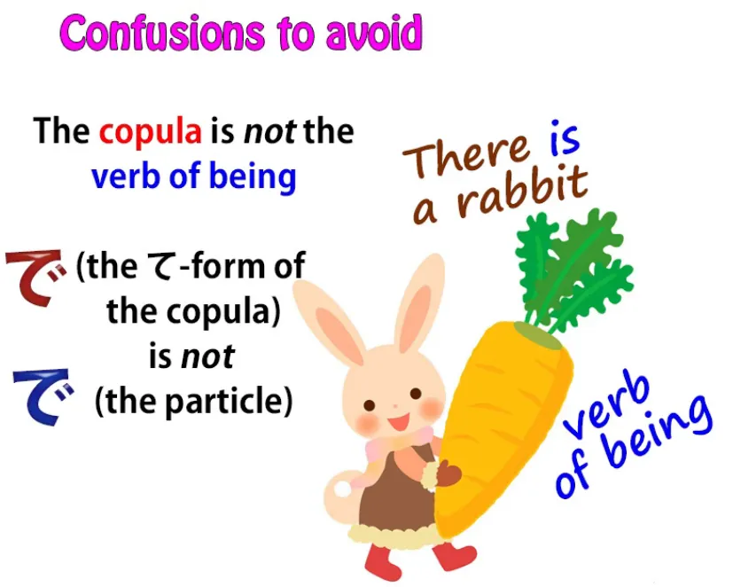

Now, because these two concepts are very easily confusable,
and because textbooks and even more advanced academic texts
do a very, very poor job of differentiating them,
**I believe it's important to keep the copula, which is**
**an unfamiliar concept in English, because English has no dedicated copula,**
**to keep it separate in the three-engine model.**
::: info
This is quite interesting, [**link here**](https://www.youtube.com/watch?v=hS02cADsjfI&lc=Ugwa71x6w5weNeypWEh4AaABAg&ab_channel=OrganicJapanesewithCureDolly) if the screenshot is too hard to read. Highly recommend reading the entire comment section under this video, as there are some interesting comments.
:::

```